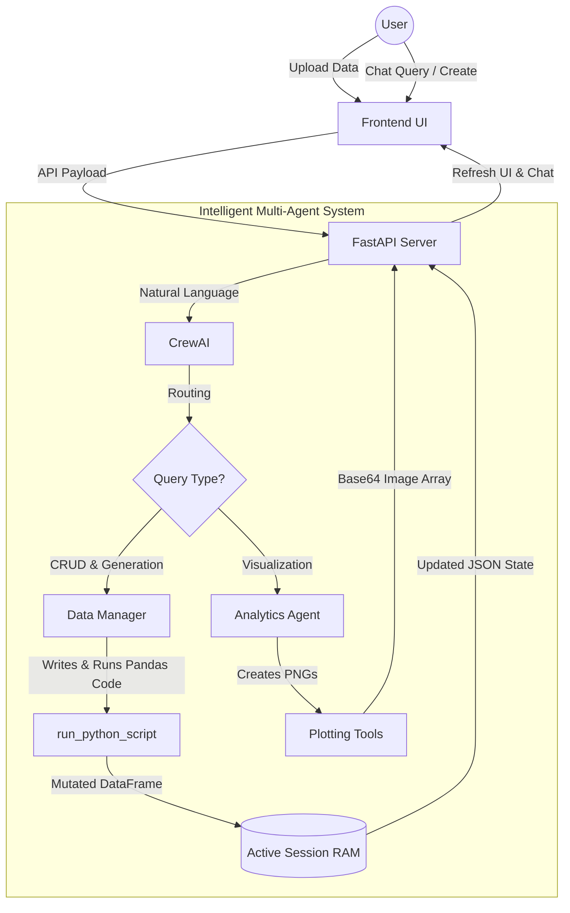

# VizData AI: Intelligent Spreadsheet Operations & Analytics

[](https://www.python.org/)
[](https://fastapi.tiangolo.com/)
[](https://www.crewai.com/)
[](https://ollama.com/)
[](https://aistudio.google.com/)

**VizData AI** is a powerful analytical platform that integrates autonomous AI agents directly into an interactive spreadsheet interface. By leveraging **Local LLMs (Ollama)** and the **CrewAI** multi-agent framework, users can chat directly with their data—telling the AI to write Pandas scripts to generate test datasets, modify spreadsheets, or automatically plot deep analytical visualizations, all completely offline.

---

## Key Features

- **Dual-Agent Architecture**:
  - **Data Manager**: Executable Data Science agent that natively writes `pandas` Python code to build, edit, sum, or reshape data interactively in real-time.
  - **Analytics Agent**: Visual statistician that ingests spreadsheet state to automatically generate and display complex `matplotlib` and `seaborn` graphs directly in your chat.
- **Spreadsheet Aesthetic**: A fully interactive grid (built entirely in Vanilla JS/CSS) featuring modern glassmorphic styling, collapsible chat sidebars, and real-time editable cells.
- **Privacy-First Local LLMs**: Built to run entirely locally with `Ollama` (using models like Qwen 2.5), overriding standard OpenAI parsers to enforce strict API tool-calls natively.
- **Multi-Format Uploads**: Effortlessly inject `.csv`, `.xlsx`, and `.xls` files directly into the active pandas memory state.

---

## Tech Stack

| **Layer** | **Technologies** |
| :--- | :--- |
| **Frontend** | Vanilla HTML5, Advanced CSS3, Vanilla JS, Lucide Icons |
| **Backend** | FastAPI, Uvicorn, Pandas, Matplotlib, Seaborn |
| **AI "Brain"** | CrewAI, LiteLLM, Ollama (Local), Google Gemini (Cloud) |
| **Environment** | Python-dotenv |

---

## Architecture



---

## Getting Started

### 1. Prerequisites
- Python 3.9+
- [Ollama](https://ollama.com/) (If running locally, pull `qwen2.5:7b` or similar)
- *(Optional)* Gemini API Key for cloud fallback.

### 2. Installation

**Clone the repository:**
```bash
git clone https://github.com/your-username/vizdata-ai.git
cd vizdata-ai
```

**Set up the Environment:**
```bash
# Create a virtual environment
python -m venv venv

# On Windows:
venv\Scripts\activate
# On MacOS/Linux:
source venv/bin/activate
```

**Install Backend Dependencies:**
```bash
pip install -r requirements.txt
```

**Environment Variables:**
Create a `.env` file in the root directory if you want to fall back to Google Gemini models instead of locally emulated Ollama paths:
```env
GEMINI_API_KEY=your_gemini_api_key_here
```

*(Note: If no key is provided, the FastAPI backend falls back recursively to local `http://localhost:11434/v1` OpenAI-emulated endpoints for total offline security)*

---

## How to Use

1. **Start the Server:**
   ```bash
   cd backend
   python main.py
   ```
2. **Access the App:** Open `http://localhost:8000` in your browser.
3. **Analyze Data:** 
   - Upload a dataset or click **Create with AI** to let the Data Manager generate a dataset from scratch using a prompt.
   - Example prompt for Data Manager: *"Create an empty dataset with columns Name, Age, Title, and Salary. Then add 5 rows of sample employee data."*
   - Example prompt for Analytics Agent: *"Plot a scatter matrix showing the relationship between Revenue and Units Sold grouped by Region."*

---

## License

Distributed under the MIT License. See `LICENSE` for more information.
